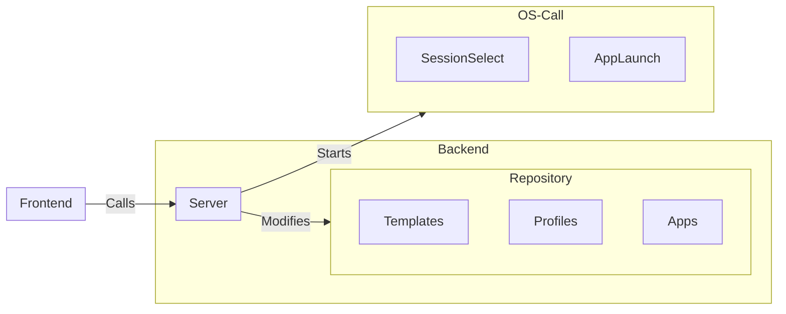
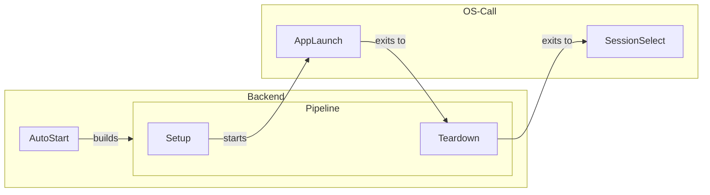

# Architecture

## Data Persistence

### Settings

Configuration for the plugin itself is stored in plaintext files the system configuration directory.

### Profiles

Profiles are stored in a local database using [native_db](https://github.com/vincent-herlemont/native_db).

Launch profiles are separated into 
- Category profiles, which apply to all apps with any configured tags
- App profiles, which configure an existing category profile for a specific app (not implemented)

### State

Execution state is persisted to a plaintext file to handle any required teardown if the system is interrupted.

## Backend Modes

The backend runs in three primary modes:

### Server

Acts as a backend server for the decky plugin. Called by Decky.

### Autostart

Auto-starts a given steam app. Called by a KDE autostart script. 

#### Limitations:
- Autostart cannot access the profile database, since native_db is not process-safe and Decky keeps the plugin server instance running in the background even in desktop mode.

### Schema

Generates type info for API calls to be made by the frontend. Called as part of the frontend build process.

