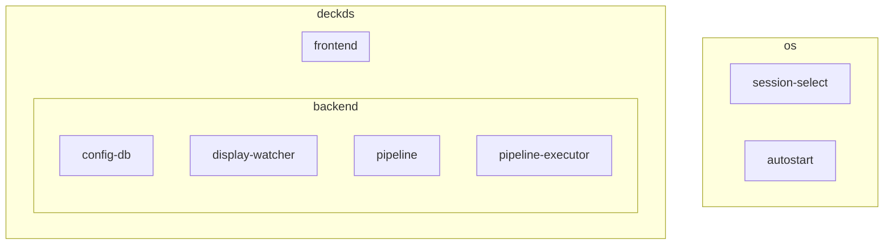

# Backend/UI Refactor

No business logic should exist in the UI layer (preferably at all, in general for pipelines). This means:

-   No custom logic for filling dropdowns
-   No custom logic for reifying/patching
-   No custom render/component logic per-item

Low Priority:

-   Dropdowns and other "selection" logic will have a predefined method of querying the server for their values
-   Actions should have a way to define/return some sort of UI schema that can be automatically rendered by the client UI

## Architecture

### Config

- A pipeline is composed of selectors.
- A selector is composed of an action OR selectors
- An action as 0..* settings
- A setting has
  - a description
  - a value
    - int
    - float
    - string
    - directory
    - file
    - display
    - audio input device
    - audio output device
    - A (sub)setting
    - An enumeration, where an enumeration is a fixed set of values OR settings
    - A list of multiple values of the same type

All configuration happens in the config files + the backend; the frontend should have not action-specific logic.

### Action

An action has:
- Setup
- Teardown
- Event handler

in it's setup, an action can register to recieve events.

Possible events are:
- Display Changed (added/removed/resized/relocated)
- Audio Device Changed (added/removed)

Its not clear whether the impl will use imperative events (describing the change), or declarative events (informing the entire new state)

### Display Handling

A "relationship" mapping will be kept between each pair of monitors to determine 
- the relative location in physical space
- which is the "primary" monitor

The system will have two "active" monitors. Internally, a list will be stored of all the monitors that have ever connected. When a monitor is selected, it will cycle to slot 0 or 1, depending on whether it is configured as a "primary" or "secondary" relative to the existing slot 0. This list will be used to determine which monitors are used if more than 2 are connected.

##### Configurator

There is likely value in a monitor configurator that can run in desktop mode, ideally one that can be brought up while playing a game, in case changes need to be made.

